# ShoppyGlobe E Commerce API

This is the backend API for the **ShoppyGlobe E-Commerce Application**.It is built using **Node.js**, **Express.js**, and **MongoDB**. The API handles product management, shopping cart operations, and user authentication using JWT (JSON Web Tokens).

## Features

* **User Authentication:** Register and Login users using JWT.
* **Product Management:** Fetch list of products and single product details.
* **Cart Management:** Add to cart, update quantity, and remove items (Protected Routes).
* **Database:** MongoDB integration using Mongoose for data persistence.
* **Security:** Password hashing with **bcryptjs** and route protection with Middleware.

## Tech Stack

* **Runtime:** Node.js
* **Framework:** Express.js
* **Database:** MongoDB (Atlas or Local)
* **ODM:** Mongoose
* **Authentication:** JSON Web Token (JWT) & bcryptjs

## Installation & Setup

Follow these steps to set up and run the project locally.

### Prerequisites

You need to have **Node.js** and **npm** (Node Package Manager) installed on your machine.

### Installation

### Clone the Repository

```bash
git clone https://github.com/GuduruVinay/ShoppyGlobe-E-Commerce-API.git
```

Or download the ZIP manually and extract it.

### Install Dependencies

Open the project folder in your terminal :

```bash
cd ShoppyGlobe-E-Commerce-API
npm install
```

This installs required dependencies.

### Environment Configuration

Create a .env file in the root directory and add the following variables:

```bash
PORT=8000
MONGO_URI=your_mongodb_connection_string
JWT_SECRET=your_secret_key_here
```

### Seed Database

To populate the database with dummy product data, run:

```bash
node seeder.js
```

### Start the Server

```bash
npm start
```

The local server will start on http://localhost:8000

## API Testing Screenshots

1. User Registration
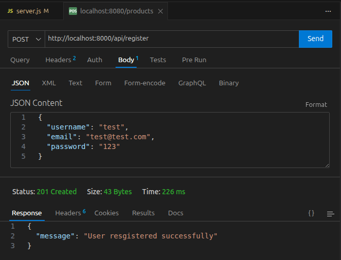

2. User Login & Token Generation
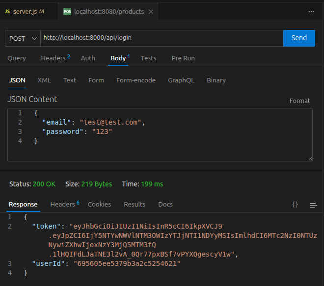

3. Fetch All Products
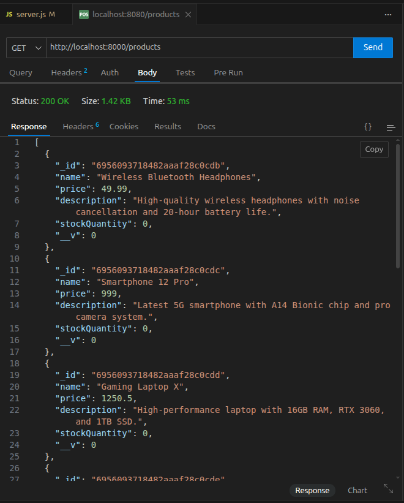

4. Fetch Single Product
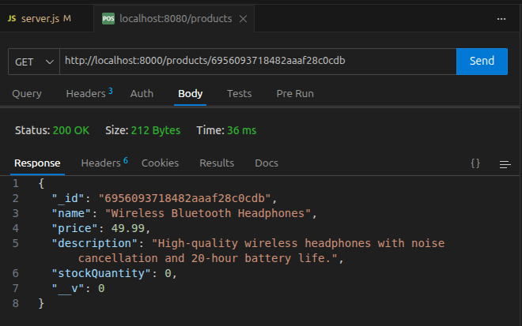

5. Add Product to the Cart (With Token)
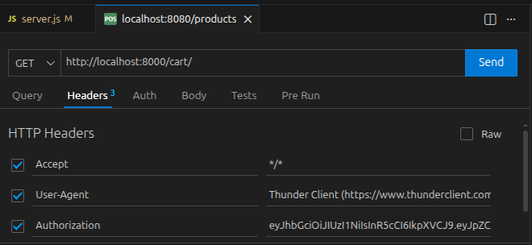
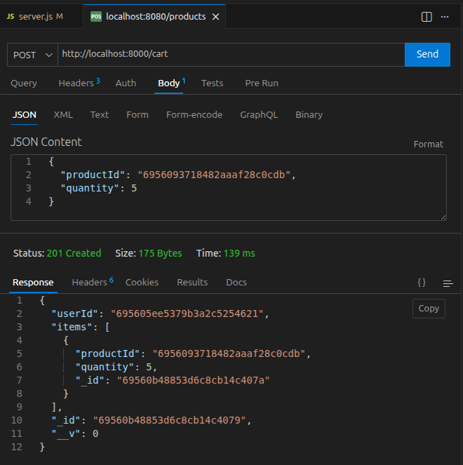

6. Update Product Quantity in the Cart
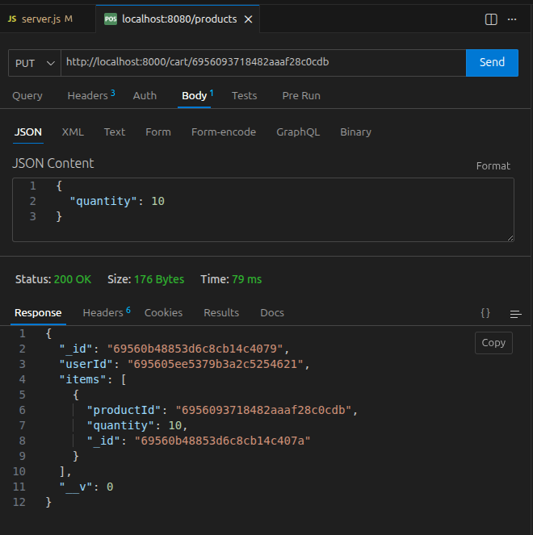

7. Delete Product from the Cart
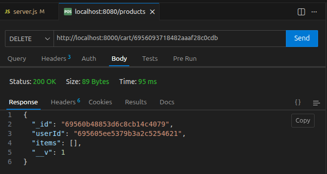

8. MongoDB Database View
* User
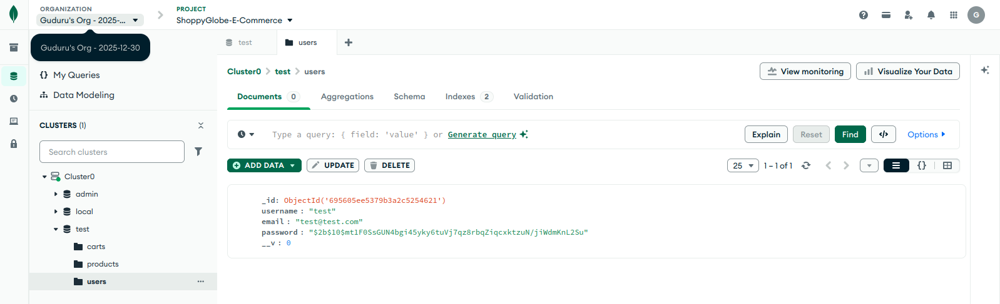
* Products
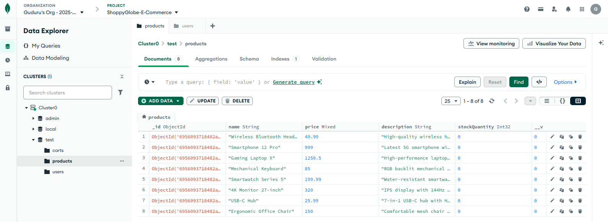
* Cart
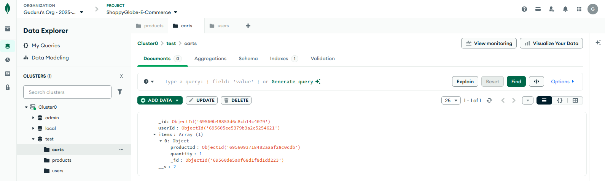

## Testing

This project was tested using ThunderClient (VS Code Extension).

1. Register a user.
2. Login to get the token.
3. Copy the token and use it in the Headers tab for Cart requests (Authorization: Bearer Token).

## GitHub Link

https://github.com/GuduruVinay/ShoppyGlobe-E-Commerce-API